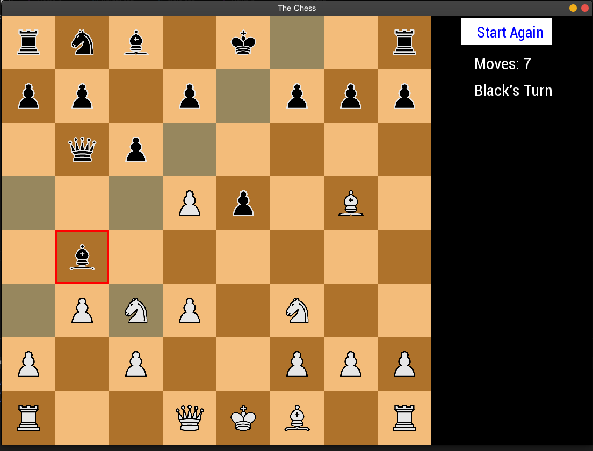
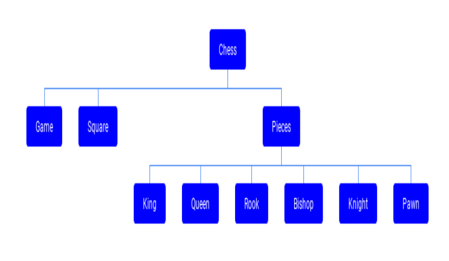

# Chess-Game

 This project is the C++ implementation of Player vs Player Chess Game in C++ using SFML graphics Library. 

 


## Class Design




 ## Setting up SFML on Linux

 ```
 $ sudo apt-get install libsfml-dev
 ```
 
## Steps to run this program

Open `src` directory and enter the following commands.

~~~
$ g++ -c main.cpp Square.cpp Pieces.cpp Knight.cpp Bishop.cpp King.cpp Queen.cpp Pawn.cpp Rook.cpp Game.cpp 

$ g++ main.o Square.o Pieces.o Knight.o Bishop.o King.o Queen.o Pawn.o Rook.o Game.o  -lsfml-graphics -lsfml-window -lsfml-system

$ ./a.out
~~~

