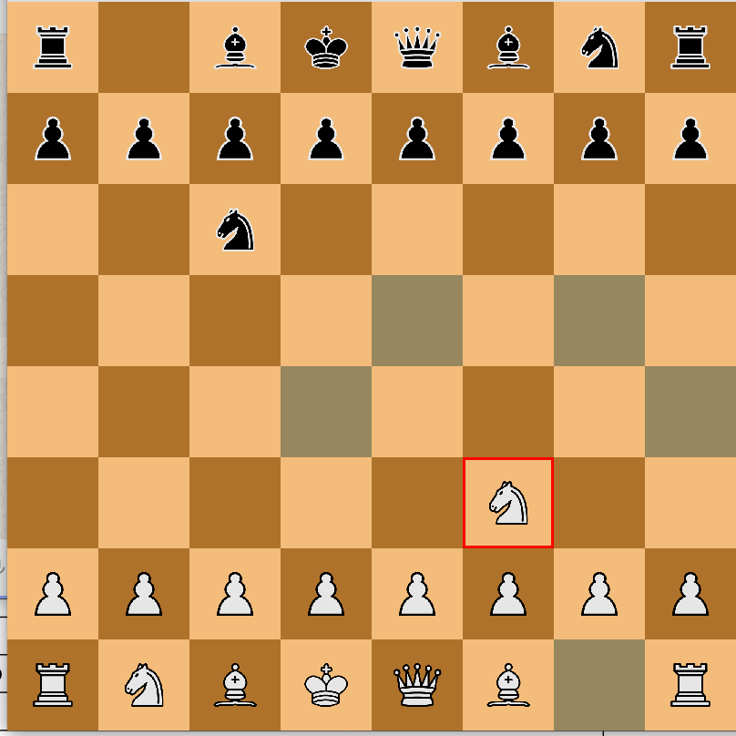

# Chess-Game

 This project is the C++ implementation of Player vs Player Chess Game in C++ using SFML graphics Library.
 


 ## Setting up SFML on linux

 ```
 sudo apt-get install libsfml-dev
 ```
## Steps to run this program

First, open src directory and enter the following commands.

```
1. g++ -c main.cpp Square.cpp Pieces.cpp Knight.cpp Bishop.cpp King.cpp Queen.cpp Pawn.cpp Rook.cpp Game.cpp
2. g++ main.o Square.o Pieces.o Knight.o Bishop.o King.o Queen.o Pawn.o Rook.o Game.o  -lsfml-graphics -lsfml-window -lsfml-system
3. ./a.out
```

